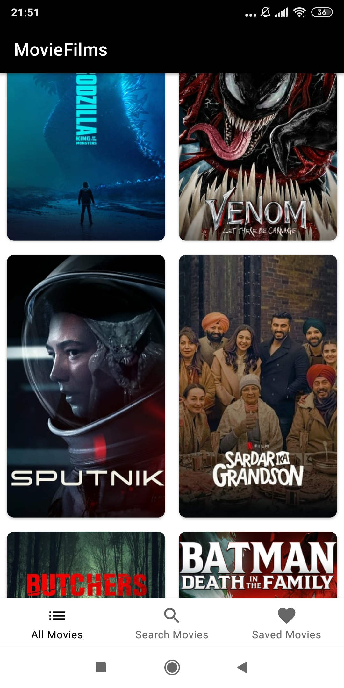
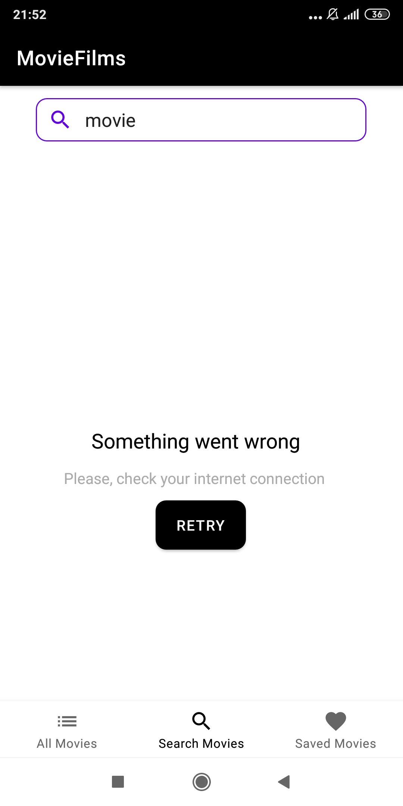
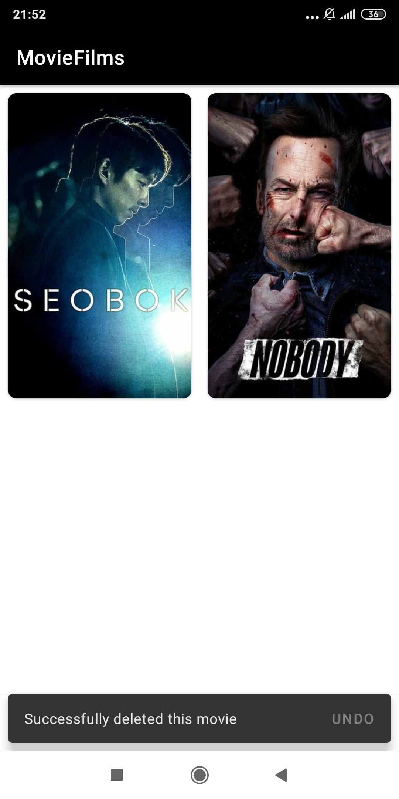

# Sample Films App

This is a sample app with **MVVM** and **Single Activity architecture**.

## Tech

 - Kotlin Coroutines
 - Dagger 2
 - Room 
 - Retrofit
 - Paging 3
 - Navigation Component
 
 
## About

### This sample app provides:

 - **endless** films list **scrolling** 
 - **searching** films
 - **saving** all information about selected films **to the database** 
 (**posters** of films are saved **to the internal storage**) and **offline access** to them
 - detailed information about every film
 - **handling** different **network and etc. errors**
 
 _Note: To successfully launch the application you should generate your own Api key_

